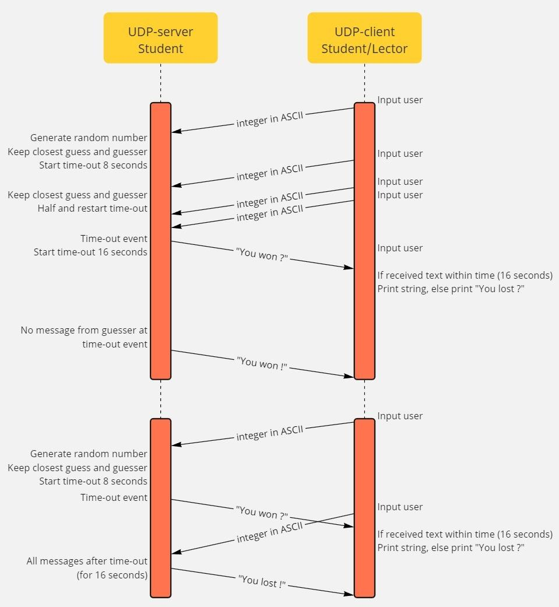
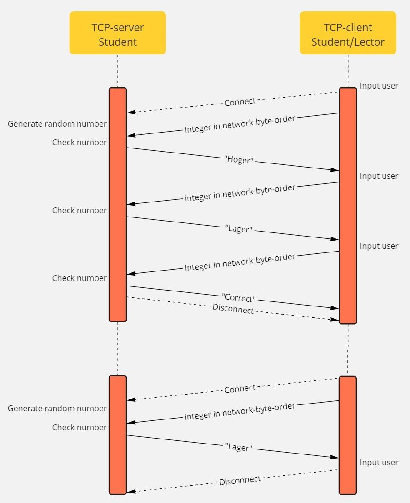

# UDP-TCP-project

## 🎯 UDP Number Guessing Game

A simple multiplayer number guessing game using the UDP protocol, designed for students lectors to demonstrate concepts like message passing, timeouts, and server-client interaction over UDP.

### 📌 Overview
This project simulates a number guessing game between a **UDP server** (Student) and a **UDP client** (Student or Lector). The server randomly generates a number and clients attempt to guess it by sending integers encoded in ASCII. The game includes a dynamic timeout mechanism to determine the winner based on the closest guess.

## 🕹️ Gameplay

### Roles:
- **UDP Server (Student)**: Generates the target number, tracks guesses, manages timeouts, and decides the winner.
- **UDP Client (Student/Lector)**: Sends guesses to the server based on user input.

### 🧠 Game Logic

## 🎯 TCP - Number Guessing Game

This section details the implementation of the number guessing game using the TCP protocol. It highlights the reliable, connection-oriented nature of TCP in contrast to the UDP implementation.

### 📌 Overview
This part of the project implements a number guessing game using the TCP protocol. It demonstrates a more reliable, connection-oriented approach to the same guessing game. The TCP server (Student) generates a random number, and a TCP client (Student/Lector) attempts to guess it through a persistent connection with feedback from the server.

## 🕹️ Gameplay

### Roles:
Roles:
- **TCP Server (Student)**: Generates a random number and interacts with the client, providing feedback on guesses.
- **TCP Client (Student/Lector)**: Establishes a connection with the server, sends guesses, and receives feedback.

### 🧠 Game Logic

